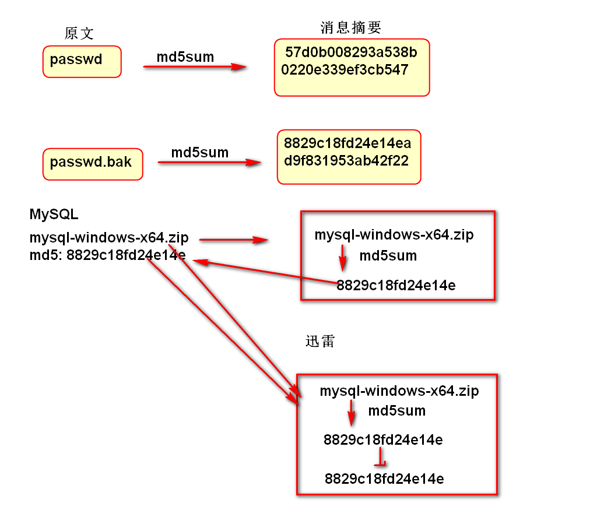

# Ajax 文件上载

## XHR2 XMLHttpRequest2

XHR2提供了异步文件上载功能。

使用步骤是：

1. 利用 `<input type="file">` 对象选择获取文件对象
2. 创建 FormData 对象用于承载上传文件。
3. 将文件对象插入到 FormData 对象 中
4. 将 FormData 对象利用Ajax发送到服务器。

### JS Ajax 上载

开发步骤：

1. 创建上载页面元素：

		<h2>ajax 上载</h2>
		

			<!-- 指定 multiple="multiple" 属性，可以选择
			多个文件 -->
			<label>选择图片</label>
			<input type="file" id="images"  
				multiple="multiple"> 
			<input id="ajax_upload" type="button" 
				value="ajax上载">
		

		<h3>选择了：</h3>
		

		

	
2. 编写脚本显示准备上载的图片：

		var images = document.getElementById("images");
		var selected=document.getElementById("selected");
		images.onchange=function(){
			var files = this.files;
			selected.innerHTML="";
			for(var i=0; i<files.length; i++){
				var f = files[i];
				var url = window.URL.createObjectURL(f);
				var img = new Image();
				img.src = url;
				selected.appendChild(img);
			}
		};
	
3. 编写Ajax上载脚本：

		var btn=document.getElementById("ajax_upload");
		btn.onclick=function(){
			var files = images.files;
			var frm = new FormData();//空白表单
			//将文件添加到frm中
			for(var i=0; i<files.length; i++){
				var f = files[i];
				frm.append("images", f, f.name);
			}
			//发起Ajax请求
			btn.value = "上载中...";
			var xhr = new XMLHttpRequest();
			xhr.open("post", "uploadImages.do");
			xhr.onreadystatechange = function(){
				if(xhr.readyState==4&&xhr.status==200){
					var json=JSON.parse(xhr.responseText);
					console.log(json);
					selected.innerHTML=json.message;
					btn.value = "ajax上载";
				}
			};
			xhr.send(frm); 
		};	

4. 编写服务器控制器接收文件上载
​
		/**
		 * 处理上载请求, 保存多个文件
		 */
		@RequestMapping(value="uploadImages.do", 
				method=RequestMethod.POST)
		@ResponseBody
		public ResponseResult<Void> uploadImages(
			@RequestParam("images") MultipartFile[] images,
			HttpServletRequest request) 
			throws IOException {
			//保存到文件系统
			String path="/images/upload";//WEB路径
			path = request.getServletContext()
					.getRealPath(path);
			System.out.println(path); 
			//创建upload文件夹
			File dir = new File(path);
			dir.mkdir();
			for (MultipartFile image : images) {
				File file=new File(dir, 
						image.getOriginalFilename());
				System.out.println("save:"+file);
				//将上载文件保存到文件中
				image.transferTo(file);
			}
			
			ResponseResult<Void> rr=new ResponseResult<Void>();
			rr.setState(ResponseResult.STATE_OK);
			rr.setMessage("上载成功");
			return rr;
		}

5. 测试

### JQuery Ajax 上载

利用JQuery也可以实现Ajax文件上载

1. 编写界面

		<h2>JQuery 上载</h2>
		

			<label>选择图片</label>
			<input type="file" id="photos"  
				multiple="multiple"> 
			<input id="jquery_upload" type="button" 
				value="jquery上载">
		

		<h3>选择了：</h3>
		

		

2. 编写脚本显示准备上载的图片

		var photos=$("#photos");
		var selectedPhotos=$("#selected_photos");
		photos.change(function(){
			var files=this.files;
			selectedPhotos.empty();
			for(var i=0; i<files.length; i++){
				var f = files[i];
				var url = window.URL.createObjectURL(f);
				var img = $("");
				selectedPhotos.append(img);
			}
		});

3. 编写上载脚本：

		var ajaxBtn=$("#jquery_upload");
		ajaxBtn.click(function(){
			var url="uploadImages.do";
			var data=new FormData();
			
			var files = photos[0].files;
			for(var i=0; i<files.length; i++){
				var f = files[i];
				data.append("images", f, f.name);
			}
			ajaxBtn.val("上载中...");
			$.ajax({
				url:url,
				type:"POST",
				data:data,
				dataType:"json",
				processData:false, //不要处理 data数据！！！
				contentType:false, //不要有JQuery设定ContentType
				success:function(json){
					ajaxBtn.val("JQuery 上载");
					selectedPhotos.html(json.message);
				}
			});
			
		});

4. 测试

# 密码加密技术（消息摘要技术）

消息摘要： 利用散列算法抽取一组数据的特征，做为这个数据的唯一标识，相当于这组数据的“指纹”

	一组数据  -- MD5、SHA散列算法 -->  消息摘要

同样的数据原文具有相同的摘要，不同的原文具有不同的摘要。

消息摘要的用途： 用于检验数据的完整性！

原理：

消息摘要技术广泛用在软件中，用于比较数据的一致性和完整性。

1. 迅雷使用消息摘要技术比较下载文件的完整性
2. 各种网盘的秒传功能就是利用消息摘要来确认需要上载文件是否与服务器已有文件一致，如果一致就秒传了！

密码加密原理：

消息摘要与密码加密

1. 消息摘要是一种检验数据完整性和一致性的技术
2. 消息摘要的用途广泛，用途之一是 密码加密
3. 消息摘要算法有很多种：MD2 MD5 SHA SHA-1 SHA-256 SHA-384 等 
	- 常用的有 MD5 SHA
4. 消息摘要算法是单向算法，只能根据数据计算摘要，无法反向计算！
5. 有摘要反向查询网址，提供了简单字符串的摘要查询！
	- 不是反向计算解密的结果！
6. 利用摘要加密密码时候，检验使用"加盐"处理，避免反向查询。

修改数据表的列

alter table t_user modify password varchar(50);

消息再要案例：

	public class TestCase {
		
		@Test
		public void testMd5() throws Exception{
			String file = "passwd";
			FileInputStream in=new FileInputStream(file);
			//计算文件的摘要
			//linux 计算摘要命令： md5sum passwd
			//mac   计算摘要命令: md5 passwd
			String md5=DigestUtils.md5Hex(in);
			System.out.println(md5);
			in.close();
		}
		
		@Test
		public void testStringMd5(){
			String password="1234";
			String md5=DigestUtils.md5Hex(password);
			System.out.println(md5); 
			
			String salt="今天你吃了吗?";
			md5 = DigestUtils.md5Hex(password+salt);
			System.out.println(md5); 
			md5 = DigestUtils.md5Hex(salt+password);
			System.out.println(md5); 
		}
		
	}
	

更新项目实行密码加密功能：

1. 更新配置文件添加“盐”：

	    <!-- 使用表达式 #{config.salt}可以读取值 -->	
	    <util:properties id="config">
	    	<prop key="salt">今天你吃了吗？</prop>
	    </util:properties>

2. 更新UserServiceImpl，增加密码加密和加密验证功能：
	
		//从Spring中找到一个BeanID为config的bean，获取
		//其salt属性的值，注入到salt变量中
		@Value("#{config.salt}")
		private String salt;

		public void register(
				String username, 
				String password, 
				String phone, 
				String email) {
			User user = new User();
			Date now = new Date();
			
			user.setUsername(username);
			
			//密码摘要加密
			System.out.println(salt);
			String pwd=DigestUtils.md5Hex(password+salt);
			System.out.println(pwd);
			
			user.setPassword(pwd);
			user.setPhone(phone);
			user.setEmail(email);
			
			
			user.setDisabled(0);
			user.setCreatedTime(now);
			user.setCreatedUser("System");
			user.setModifiedTime(now);
			user.setModifiedUser("System");
			
			register(user);
		}
	
		@Transactional
		public User login(String username, 
				String password) {
			//为了测试AOP功能添加的 测试代码
			System.out.println("登录功能");
			
			if(username.equals("chenghen2")){
				System.out.println("异常");
				throw new RuntimeException("出异常了");
			} 
			
			User u = findUserByUsername(username);
			if (u == null) {
				return null;
			} else {
				//比较摘要加密以后的密码
				String pwd=DigestUtils.md5Hex(password+salt);
				if (u.getPassword().equals(pwd)) {
					return u;
				} else {
					return null;
				}
			}
		}
	
		public int updatePassword(Integer uid, 
				String oldPassword, 
				String newPassword) {
			// 初始化：参数、返回值
			int state = -1;
			
			// 处理业务
			// 根据uid获取用户信息
			User user = userMapper.findUserById(uid);
			// 判断用户输入的旧密码是否正确
			String pwd=DigestUtils.md5Hex(oldPassword+salt);
			if (user.getPassword().equals(pwd)) {
				// 密码正确，允许修改
				pwd = DigestUtils.md5Hex(newPassword+salt);
				userMapper.updatePassword(uid, pwd);
				// 给正确的返回值
				state = 1;
			}
			
			// 返回
			return state;
		}

# Linux

## 什么是Linux 

1. 是一个OS，是Unix克隆版
2. Linux使用非常广泛

## Linux 命令

命令的基本结构

	命令  [选项]...  [参数]...

	ls
	ls -a
	ls -a /
	ls -al / 
	ls -a -l /

## 使用命令操作Linux 

	pwd 显示当前工作目录 
	ls 显示文件目录内容
	cd 改变工作目录

### 文件管理命令

对文件和文件夹实现创建，删除，移动，改名等功能

创建文件夹命令：

	mkdir 文件夹

创建文件命令
	
	touch 文件名

移动或者改名命令

	mv 文件/文件夹 新文件/新文件夹   
	mv 文件/文件夹 已经存在文件夹
	

